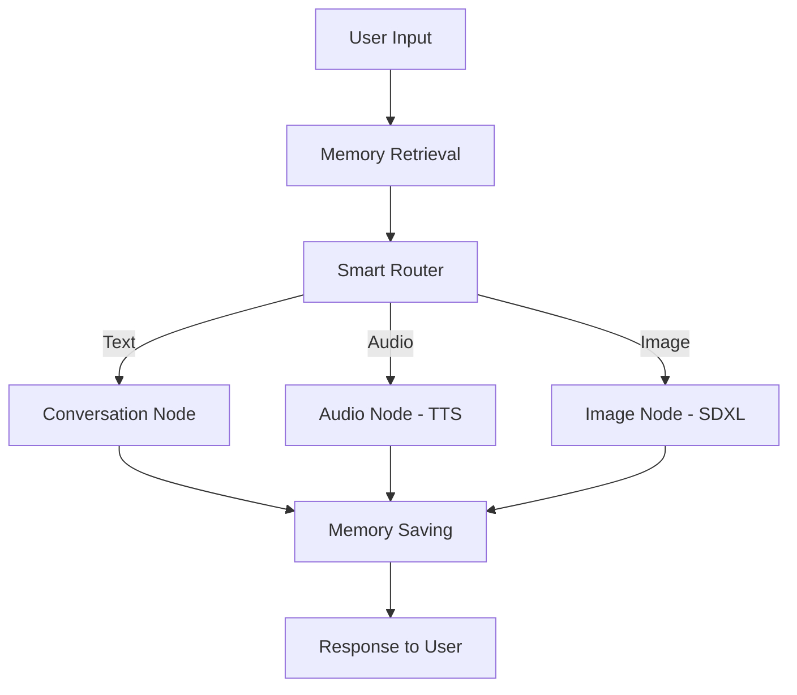

<p align="center">
    
    <h1 align="center">Coach Aria</h1>
    <h3 align="center">A Multimodal AI Life Coach with Voice, Vision & Memory</h3>
</p>

---

## Hi, I'm Bhim Prasad Adhikari

I'm a **2nd year undergraduate student** pursuing **AI & Machine Learning**, and I built this project to showcase my passion for building end-to-end AI systems.

**Coach Aria** isn't just another chatbot — it's a fully-functional, multimodal AI agent that can:

- **Have meaningful coaching conversations** powered by Llama 3.3
- **Understand your voice** using Whisper STT
- **Speak back to you** with natural voice synthesis via ElevenLabs
- **Generate contextual images** using Stable Diffusion XL
- **Remember important details** about you across sessions using vector memory
- **Intelligently route** between text, audio, and image responses

> I built this to demonstrate that I can design, architect, and implement complex AI systems from scratch — not just follow tutorials.

---

## Features in Action

### Conversational Coaching
<!-- Add screenshot: public/screenshots/conversation.png -->


*Aria provides empathetic, growth-mindset coaching powered by Llama 3.3*

### Voice Interaction
<!-- Add screenshot: public/screenshots/voice.png -->


*Send voice messages and receive natural voice responses*

### AI Image Generation

Aria can generate contextual images based on the conversation. Here are some examples:

<p align="center">
    
    
</p>

<p align="center">
    
    
</p>

*Images generated by Stable Diffusion XL based on coaching conversations*

---

## What Can Aria Do?

| Capability | Description | Technologies |
|------------|-------------|--------------|
| **Conversational Coaching** | Empathetic, growth-mindset based conversations | LangGraph, Groq Llama 3.3 |
| **Voice Input** | Transcribes your voice messages in real-time | Whisper Large v3 Turbo via Groq |
| **Voice Output** | Sends voice responses that sound natural | ElevenLabs TTS |
| **Image Generation** | Creates visualizations based on conversation context | Stable Diffusion XL via HuggingFace |
| **Long-Term Memory** | Remembers your goals, challenges, and preferences | Vector Store + Semantic Search |
| **Smart Routing** | Automatically decides when to respond with text, voice, or images | LLM-powered intent classification |

---

## System Architecture



The architecture follows a **stateful graph-based workflow** using LangGraph:

1. **Memory Retrieval Node** — Fetches relevant past memories using semantic search
2. **Router Node** — Classifies user intent (conversation, audio, or image request)
3. **Response Nodes** — Generates appropriate response based on routing decision
4. **Memory Saving Node** — Extracts and stores important information for future sessions

---

## Tech Stack

| Layer | Technology |
|-------|------------|
| **Framework** | LangGraph |
| **LLM** | Groq (Llama 3.3 70B) |
| **STT** | Whisper Large v3 Turbo |
| **TTS** | ElevenLabs |
| **Image Gen** | Stable Diffusion XL |
| **Vector DB** | Qdrant |
| **Interface** | Chainlit |
| **Deployment** | Google Cloud Run |

---

## Getting Started

### Prerequisites

- Python 3.13+
- API Keys for: Groq, ElevenLabs, HuggingFace, Qdrant

### Installation

```bash
# Clone the repository
git clone https://github.com/BhimPrasadAdhikari/whatsapp-agent.git
cd whatsapp-agent

# Create virtual environment
python -m venv venv
source venv/bin/activate  # On Windows: venv\Scripts\activate

# Install dependencies
pip install -r requirements.txt
```

### Environment Setup

Create a `.env` file in the root directory:

```env
GROQ_API_KEY=your_groq_api_key
ELEVENLABS_API_KEY=your_elevenlabs_api_key
HF_TOKEN=your_huggingface_token
QDRANT_URL=your_qdrant_url
QDRANT_API_KEY=your_qdrant_api_key
```

### Run the Application

```bash
chainlit run interfaces/chainlit/app.py -w
```

---

## Let's Connect!

I'm actively looking for **internship and full-time opportunities** in AI/ML Engineering.

<p align="center">
    <a href="https://linkedin.com/in/your-linkedin">LinkedIn</a> •
    <a href="mailto:your-email@example.com">Email</a> •
    <a href="https://github.com/BhimPrasadAdhikari">GitHub</a>
</p>

---

## License

This project is open source and available under the [MIT License](LICENSE).

---

<p align="center">
    <i>Built with ❤️ by Bhim Prasad Adhikari</i>
</p>
